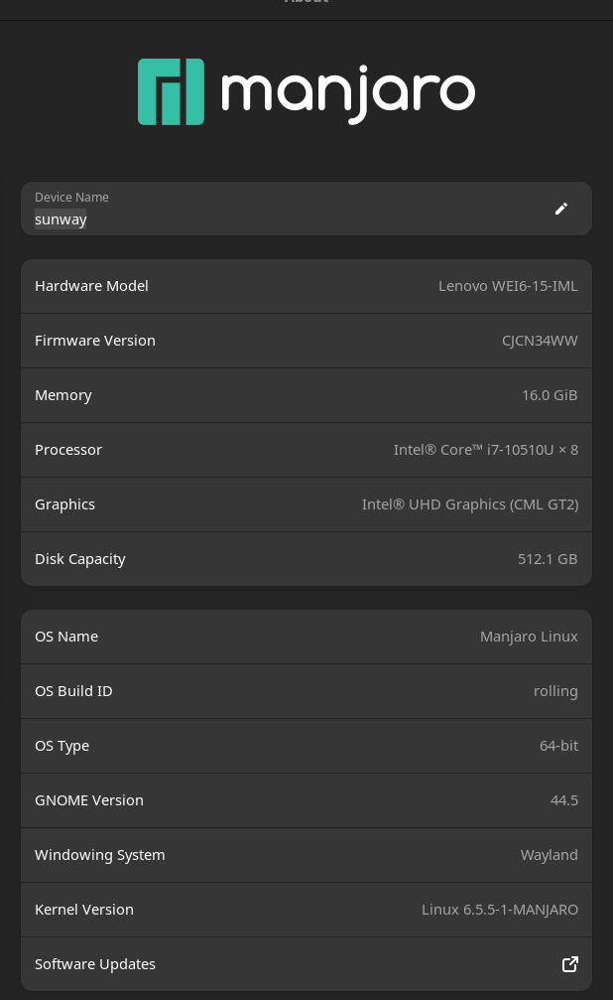

# Problems when I use manjaro

我是2023年10月4日安装的manjaro系统，对于一个新系统，总是会遇到这样或那样的问题，如果自己通过网上search solution但是不记录的话，那么下次再遇到相同的问题，仍然可能需要付出努力去find answer,所以记录下来，如果能帮到更多的人，那就更好了。

## 分区

分区的时候记得要多给根目录点空间，个人用户我建议跟home直接1：1,因为，大部分应用不是装在了家目录里，而是根目录下的一个目录里。

## 安装输入法

主要是安装fictx5,然后配置一下文件。我是跟着B站一个up主的一个视频做的，没有问题。<https://www.bilibili.com/video/BV1GL4y1G747/?spm_id_from=333.999.0.0&vd_source=366126932fae06c5958a97f50215413b>做的。

## 安装WPS

提到manjaro linux 缺少一个基础软件，安装后成功解决了问题。于是参照执行，果然成功了。记录一下

一，先安装这个：sudo pacman -S base-devel
二，再安装就成功了。yay -S wps-office-cn wps-office-mui-zh-cn
三，字体安装：sudo pacman -S ttf-wps-fonts

安装完成之后，还遇到了两个问题，第一个是无法导出为pdf,这个可以安装一个包解决：
> yay -S libtiff5

第二个问题是加粗的字体，显示有问题，如：

## 换源

配置源
配置中国的 mirrors，在 终端 执行下面的命令从官方的源列表中对中国源进行测速和设置：

>sudo pacman-mirrors -g  # 排列源，可不执行
>sudo pacman-mirrors -i -c China -m rank # 更改源，在跳出的对话框里选择想要的源

为 Manjaro 增加中文社区的源来加速安装软件，在 /etc/pacman.conf 中添加 archlinuxcn 源，末尾加上：

只能添加一个，建议官方源

~~~bash

[archlinuxcn]
# The Chinese Arch Linux communities packages.
# SigLevel = Optional TrustedOnly
SigLevel = Optional TrustAll
# 官方源
Server   = http://repo.archlinuxcn.org/$arch
# 163源
Server = http://mirrors.163.com/archlinux-cn/$arch
# 清华大学
Server = https://mirrors.tuna.tsinghua.edu.cn/archlinuxcn/$arch
~~~

## 安装edge等

直接在add/remove software中安装即可

## flameshot

sudo pacman -S flameshot

笔者这里配置的是Ctrl+Alt+A，再点击动作，配置命令/URL为/usr/bin/flameshot gui，最后应用该配置即可

但后来不知为何失灵了，快捷键失效，但是命令行还能用。这个问题有待进一步探索，反正用命令行也不是不行。。

## 腾讯会议

问题描述：会议过程中，有声音但是没有画面。

原因：manjaro使用的通信协议为Wayland,但是腾讯会议不支持，他们只支持xcfg(x11)。

我的解决方法：在～/.zshrc中加入以下代码：

~~~bash
if [ "$(basename "$0")" = 'wemeet-x11' ]; then
    # force x11
    export XDG_SESSION_TYPE=x11
    export QT_QPA_PLATFORM=xcb
    unset WAYLAND_DISPLAY
fi

~~~

最后source ~/.zshrc 即可。
